### Enhancing Underwater Images and Videos by Fusion

**CVPR-2012: 一种用于增强水下图像和视频的融合策略**

水下环境由于光的吸收和散射导致图像和视频的可见性差，主要表现为对比度低、颜色失真和远处物体模糊。为了解决这些问题，本文提出了一种基于图像融合的策略，通过处理单个退化图像来生成增强效果，无需额外的硬件支持或多帧图像输入。

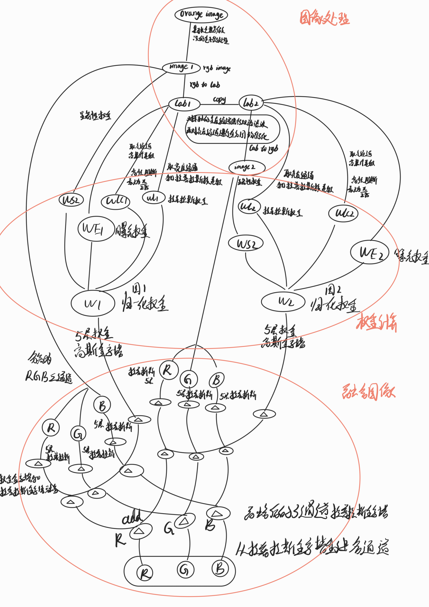

### 方法概述

论文的方法基于多尺度融合的原则，分为三个主要步骤：

1. **输入图像的生成**：从退化的原始图像生成两个输入图像。第一个输入是经过颜色校正的图像，第二个输入是经过对比度增强和噪声抑制处理后的图像。
2. **权重图的定义**：定义了四种权重图，用于在融合过程中为不同的图像区域赋予不同的重要性。
3. **多尺度融合过程**：使用拉普拉斯金字塔进行多尺度融合，结合权重图和输入图像，生成增强的输出图像。

### 1. 输入图像的生成

#### 1.1 **白平衡处理**

为了去除水下环境中的颜色偏移，使用改进的灰度世界算法进行白平衡处理。这个步骤生成了第一个输入图像，即颜色校正后的图像，旨在消除蓝色或绿色的色调，使图像更加自然。

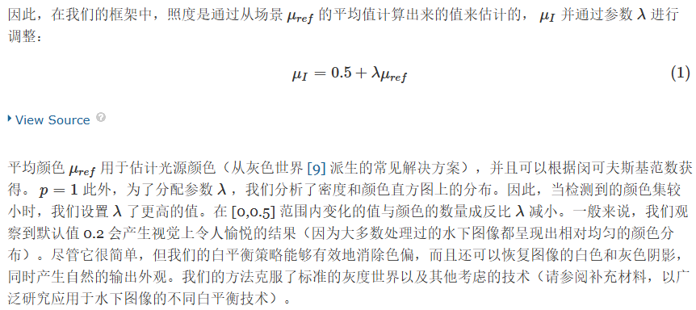

#### 1.2 **降噪处理**

在白平衡后的图像上应用双边滤波器进行降噪，双边滤波器能够在保留图像边缘的同时减少噪声。对于视频处理，使用时间双边滤波，以确保相邻帧之间的一致性，避免运动伪影。

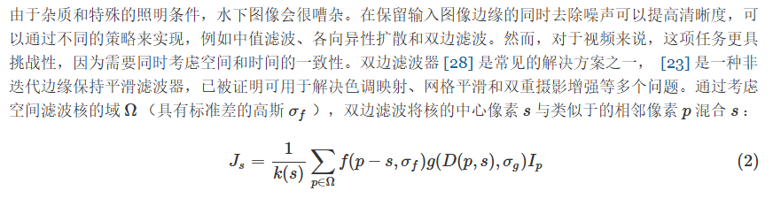

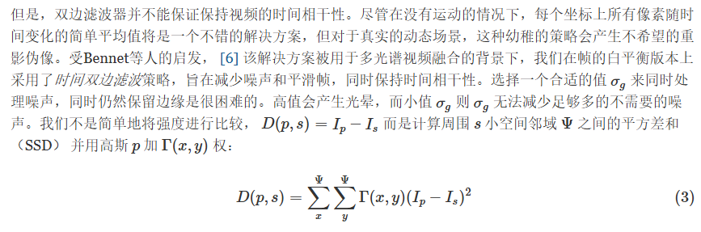

#### 1.3 **对比度增强**

对降噪后的图像应用局部自适应直方图均衡化技术，显著改善图像的对比度，特别是低对比度区域。这一步生成了第二个输入图像。

### 2. 权重图的计算

为决定哪些图像区域在融合过程中占主导地位，定义了四个权重图，分别基于不同的图像特性计算：

#### 2.1 **Laplacian 对比度权重图（WL）**

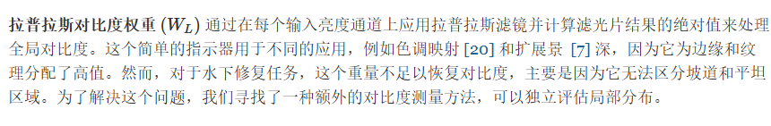

通过计算输入图像的亮度通道上的拉普拉斯滤波结果（取绝对值）来生成，该权重图用于增强图像的全局对比度，突出边缘和纹理。

#### 2.2 **局部对比度权重图（WLC）**

计算每个像素与其邻域平均值之间的标准差，增强局部对比度，突出图像中高亮和阴影区域的细节。

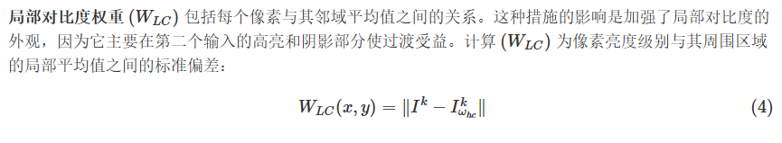

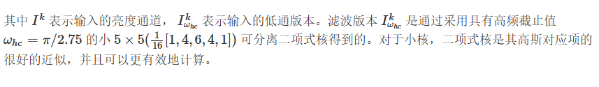

#### 2.3 **显著性权重图（WS）**

使用显著性检测算法识别和突出图像中视觉上重要的区域，确保这些区域在最终输出中得到保留。（ Frequency-tuned salient region detection **1.** R. Achantay、S. Hemamiz、F. Estraday 和 S. Susstrunky。频率调谐显著区域检测。IEEE CVPR，2009 年。）

#### 2.4 **曝光度权重图（WE）**

评估每个像素的曝光程度，确保图像既不过度曝光也不过暗。通过与中等亮度值（通常为0.5）进行比较来计算该权重图。

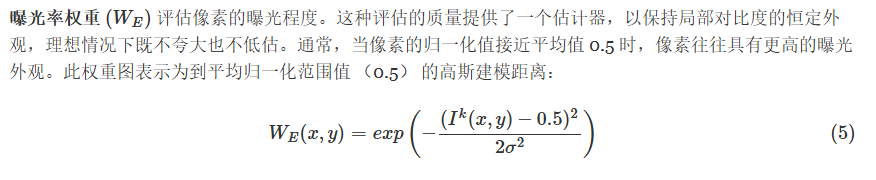

### 3. 多尺度融合处理

#### 3.1 **多尺度融合**

将每个输入图像通过拉普拉斯金字塔分解为多个尺度的特征层。同时，将每个权重图通过高斯金字塔分解为相应的尺度层。在每个尺度上，将输入图像的拉普拉斯金字塔层与对应的权重图的高斯金字塔层进行融合。

#### 3.2 **图像重构**

将融合后的各尺度层次图像叠加，最终生成增强后的图像。

### 4. 结果分析与应用

#### 4.1 **应用场景**

该方法在图像分割、图像匹配（如使用SIFT特征点）和去雾处理等任务中表现出色，适用于改善各种水下图像和视频的视觉效果，特别是在资源受限的环境中。

#### 4.2 **性能与局限性**

该方法具有较高的计算效率，可以在普通硬件上接近实时处理图像。然而，在极深水区域或光照极差的场景中，该方法可能无法完全恢复物体的颜色和细节。

### 总结和实验效果

通过本文提出的多尺度融合方法，能够显著改善水下图像和视频的可见度、对比度和颜色表现，适用于各种水下环境和摄像设备，且无需复杂硬件支持。这种方法在图像处理领域具有广泛的应用前景，特别是在水下探测和监控等领域。

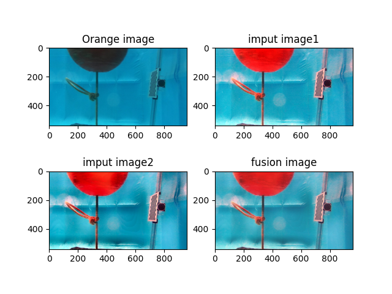

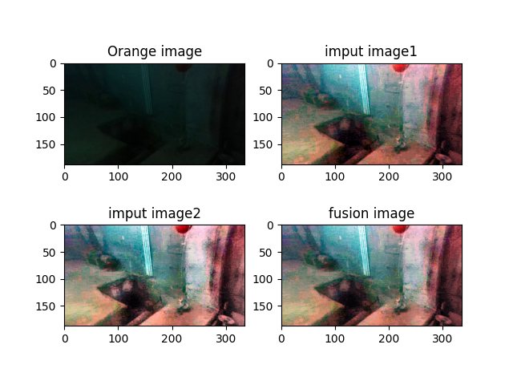

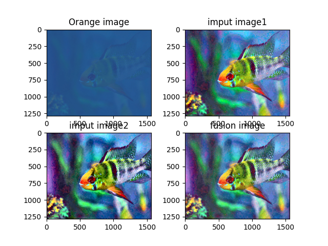

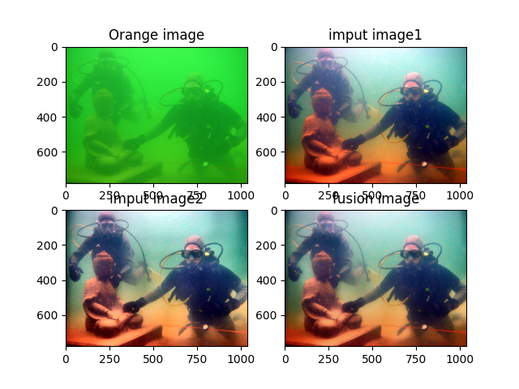

